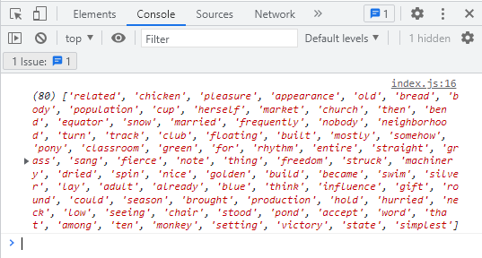
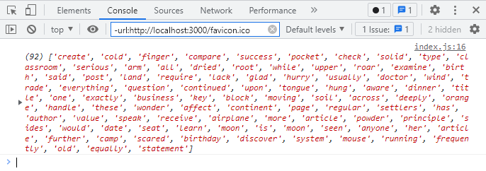
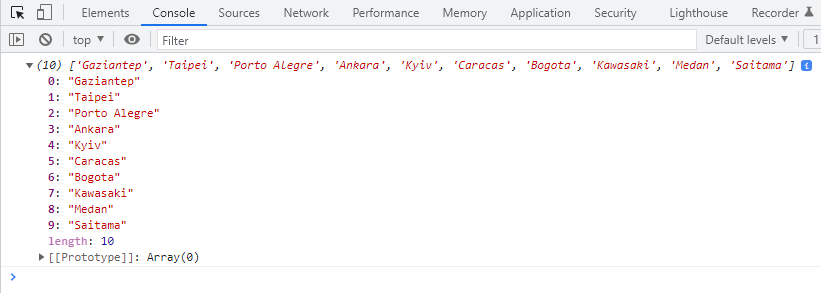
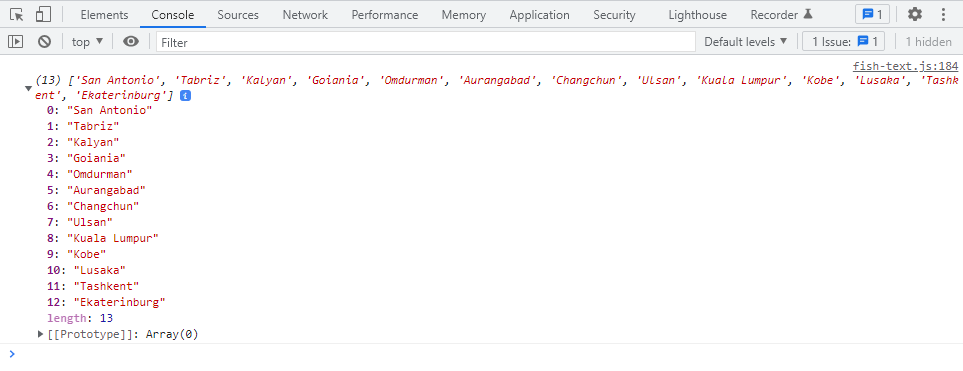
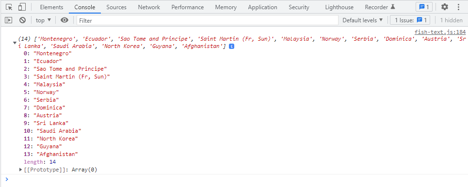

# FishText library :) generate fish text for your data!
we work with two languages - **Russian** and **English**

***

## we use real words in Russian and English!
* **5000 Russian lang words**
* **1954 English lang words**
* **365 Cities in English lang**
* **366 Cities in Russian lang**
* **229 Countries in English lang**
* **229 Countries in Russian lang**

* **456 Russian Names**
* **2738 English Names :)**
* **503 Russian surnames**
* **1000 English surnames**

***The number of catches and languages is expanding over time!***
***This will help you generate test data for your project!***

***

## what do you need to start

* **download NPM library**

```
npm i --save-dev fish-text
```

* **import library in your file**
```
import { fishText } from '../node_modules/fish-text/fish-text.js';
```

***

## **how it works?**

**you can get either a certain number of words,**
**or a random number from a given range.**

***

### BASIC PARAMETERS

Parameters accept only an object!
Methods with the name ```getRandomRange...({})``` have two required parameters: min and max!

```
fishText.getRandomRangeWords({min: 10, max: 20});
```

If you want to get only one word, then you just need to pass an empty object to the function parameters.
An empty object can only be accepted by functions with the name ```get...({})```.

```
fishText.getWords({});
```

* **```dataType```** - data type to be returned.
  **optional** parameter! the default data type is ```string```.
  there are 3 data options: ```string```, ```array```, ```object```
* **```lang```** - ```'eng'``` or ```'rus'```
  **optional parameter!** the default language is English.
* **```repeat```** - ```true``` or ```false```
  **optional parameter! Default value is** ```false```
  if you need all words to be unique, then set the parameter ```true```, and vice versa.
  **Attention!** with the "repeat" parameter enabled, it is impossible to get unique words in an amount exceeding the number of words in the library!

***

1. ### GET A CERTAIN NUMBER OF WORDS.

#### **Method ```getWords()```**
*you will get exactly as many words as you write in the parameters.*

*let's try to get 80 English words in the array:)*
* **example!**
```
  let text = fishText.getWords({count: 80, dataType: 'array', lang: 'eng', repeat: false});

  console.log(text);
```
* **result**



##### **SPECIAL PARAMETERS!**

* **```count```** - number of words
  **optional parameter.** if you do not specify a count, then one word will be returned to you.

***

2. ### GET A RANDOM NUMBER OF WORDS FROM A RANGE.


#### **Method ```getRandomRangeWords()```**
*You set 2 parameters - the minimum number and the maximum, and get a random number of words in the given range.*

*Let's try to get from 50 to 100 words:)*
* **example!**
```
  let text = fishText.getRandomRangeWords({min: 50, max: 100, dataType: 'array', lang: 'eng', repeat: false});

  console.log(text);
```
* **result**



##### **SPECIAL PARAMETERS!**

* **```min```** - minimum number of words.
  **this is a required parameter!**
* **```min```** - maximum number of words.
  **this is a required parameter!**

***

3. ### GET A CERTAIN NUMBER OF CITIES

#### **Method ```getCities()```**
*you will get exactly as many cities as you write in the parameters*

*let's try to get 10 city names in English in the array:)*
* **example!**
```
  let cities = fishText.getCities({count: 10, lang: 'eng', dataType: 'array', repeat: true});

  console.log(cities);
```
* **result**



##### **SPECIAL PARAMETERS!**

* **```count```** - number of cities
  **optional parameter.** if you do not specify a count, then one city will be returned to you.

***

4. ### GET A RANDOM NUMBER OF CITIES FROM A RANGE

#### **Method ```getRandomRangeCities()```**
*You set 2 parameters - the minimum number and the maximum, and get a random number of cities in the given range.*

*Let's try to get from 10 to 20 cities:)*
* **example!**
```
  let cities = fishText.getRandomRangeCities({min: 10, max: 20, lang: 'eng', dataType: 'array', repeat: true});

  console.log(cities);
```
* **result**



##### **SPECIAL PARAMETERS!**

* **```min```** - minimum number of cities.
  **this is a required parameter!**
* **```min```** - maximum number of cities.
  **this is a required parameter!**

***

5. ### GET A CERTAIN NUMBER OF COUNTRIES

#### **Method ```getCountries()```**
*you will get exactly as many cities as you write in the parameters*

*let's try to get 10 countries names in English in the array:)*
* **example!**
```
  let countries = fishText.getCountries({count: 10, lang: 'eng', dataType: 'array', repeat: true});

  console.log(countries);
```
* **result**


##### **SPECIAL PARAMETERS!**

* **```count```** - number of countries
  **optional parameter.** if you do not specify a count, then one city will be returned to you.

***

6. ### GET A RANDOM NUMBER OF COUNTRIES FROM A RANGE

#### **Method ```getRandomRangeCountries()```**
*You set 2 parameters - the minimum number and the maximum, and get a random number of cities in the given range.*

*Let's try to get from 10 to 20 countries:)*
* **example!**
```
  let countries = fishText.getRandomRangeCountries({min: 10, max: 20, lang: 'eng', dataType: 'array', repeat: true});

  console.log(countries);
```
* **result**



##### **SPECIAL PARAMETERS!**

* **```min```** - minimum number of countries.
  **this is a required parameter!**
* **```min```** - maximum number of countries.
  **this is a required parameter!**

***

6. ### GET A CERTAIN NUMBER OF NAMES AND SURNAMES.

#### **Method ```getNames()```**
*You will get exactly as many names or surnames as you write in the parameters*
*You can get either a separate first name or surname, or get a full name.*

*let's try to get 10 fullnames in English in the array:)*
* **example!**
```
  let names = fishText.getNames({count: 10, type: 'full', lang: 'eng', dataType: 'array'});

  console.log(names);
```
* **result**


##### **SPECIAL PARAMETERS!**

* **```count```** - number of countries
  **optional parameter.** if you do not specify a count, then one city will be returned to you.
* **```type```** - maximum number of countries.
  The type of name to get. you can get a separate first name, surname or full name (name + surname)
  **optional parameter.** default value ```full```.
  there are 3 data options: ```full```, ```name```, ```surname```.
* **This method does not have a 'repeat' parameter!**
