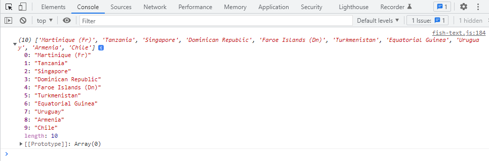

# FishText library :) generate fish text for your data!
we work with two languages - **Russian** and **English**

***

## we use real words in Russian and English!
* **5000 Russian words**
* **1954 English words**
***The number of catches and languages is expanding over time!***
***This will help you generate test data for your project!***

***

## what do you need to start

* **download NPM library**

```
npm i --save-dev fish-text
```

* **import library in your file**
```
import { fishText } from '../node_modules/fish-text/fish-text.js';
```

***

## **how it works?**

**you can get either a certain number of words,**
**or a random number from a given range.**

***

1. ### GET A CERTAIN NUMBER OF WORDS.

#### **Method ```getWords()```**
*you will get exactly as many words as you write in the parameters.*

*let's try to get 80 English words in the array:)*
* **example!**
```
  let text = fishText.getWords({count: 80, dataType: 'array', lang: 'eng', repeat: false});

  console.log(text);
```
* **result**


##### **PARAMETRS!**
an object is accepted as a parameter!
If you want to get only one word, then you just need to pass an empty object to the function parameters.
```
fishText.getWords({});
```
* **```wordsCount```** - number of words
  **optional parameter.** if you do not specify a count, then one word will be returned to you.
* **```dataType```** - data type to be returned.
  **optional** parameter! the default data type is ```string```.
  there are 3 data options: ```string```, ```array```, ```object```
* **```lang```** - ```'eng'``` or ```'rus'```
  **optional parameter!** the default language is English.
* **```repeat```** - ```true``` or ```false```
  **optional parameter! Default value is** ```false```
  if you need all words to be unique, then set the parameter ```true```, and vice versa.
  **Attention!** with the "repeat" parameter enabled, it is impossible to get unique words in an amount exceeding the number of words in the library!

  ***

2. ### GET A RANDOM NUMBER OF WORDS FROM A RANGE.


#### **Method ```getRandomRangeWords()```**
*You set 2 parameters - the minimum number and the maximum, and get a random number of words in the given range.*

*Let's try to get from 50 to 100 words:)*
* **example!**
```
  let text = fishText.getRandomRangeWords({min: 50, max: 100, dataType: 'array', lang: 'eng', repeat: false});

  console.log(text);
```
* **result**


##### **PARAMETRS**
an object is accepted as a parameter!
```
fishText.getCities({min: 10, max: 20});
```
* **```min```** - minimum number of words.
  **this is a required parameter!**
* **```min```** - maximum number of words.
  **this is a required parameter!**
* **other parameters are the same as in the example above;)**

***

3. ### GET A CERTAIN NUMBER OF CITIES

#### **Method ```getCities()```**
*you will get exactly as many cities as you write in the parameters*

*let's try to get 10 city names in English in the array:)*
* **example!**
```
  let cities = fishText.getCities({count: 10, lang: 'eng', dataType: 'array', repeat: true});

  console.log(cities);
```
* **result**


##### **PARAMETRS!**
an object is accepted as a parameter!
If you want to get only one city name, then you just need to pass an empty object to the function parameters.
```
fishText.getCities({});
```
* **```count```** - number of cities
  **optional parameter.** if you do not specify a count, then one city will be returned to you.
* **```dataType```** - data type to be returned.
  **optional** parameter! the default data type is ```string```.
  there are 3 data options: ```string```, ```array```, ```object```
* **```lang```** - ```'eng'``` or ```'rus'```
  **optional parameter!** the default language is English.
* **```repeat```** - ```true``` or ```false```
  **optional parameter! Default value is** ```false```
  if you need all words to be unique, then set the parameter ```true```, and vice versa.
  **Attention!** with the "repeat" parameter enabled, it is impossible to get unique words in an amount exceeding the number of words in the library!

  ***

4. ### GET A RANDOM NUMBER OF CITIES FROM A RANGE

#### **Method ```getRandomRangeCities()```**
*You set 2 parameters - the minimum number and the maximum, and get a random number of cities in the given range.*

*Let's try to get from 10 to 20 cities:)*
* **example!**
```
  let cities = fishText.getRandomRangeCities({min: 10, max: 20, lang: 'eng', dataType: 'array', repeat: true});

  console.log(cities);
```
* **result**


##### **PARAMETRS**
an object is accepted as a parameter!
```
fishText.getCities({min: 10, max: 20});
```
* **```min```** - minimum number of cities.
  **this is a required parameter!**
* **```min```** - maximum number of cities.
  **this is a required parameter!**
* **other parameters are the same as in the example above;)**

***

5. ### GET A CERTAIN NUMBER OF COUNTRIES

#### **Method ```getCountries()```**
*you will get exactly as many cities as you write in the parameters*

*let's try to get 10 countries names in English in the array:)*
* **example!**
```
  let countries = fishText.getCountries({count: 10, lang: 'eng', dataType: 'array', repeat: true});

  console.log(countries);
```
* **result**



##### **PARAMETRS!**
an object is accepted as a parameter!
If you want to get only one country name, then you just need to pass an empty object to the function parameters.
```
fishText.getCountries({});
```
* **```count```** - number of countries
  **optional parameter.** if you do not specify a count, then one city will be returned to you.
* **```dataType```** - data type to be returned.
  **optional** parameter! the default data type is ```string```.
  there are 3 data options: ```string```, ```array```, ```object```
* **```lang```** - ```'eng'``` or ```'rus'```
  **optional parameter!** the default language is English.
* **```repeat```** - ```true``` or ```false```
  **optional parameter! Default value is** ```false```
  if you need all words to be unique, then set the parameter ```true```, and vice versa.
  **Attention!** with the "repeat" parameter enabled, it is impossible to get unique words in an amount exceeding the number of words in the library!

  ***

6. ### GET A RANDOM NUMBER OF COUNTRIES FROM A RANGE

#### **Method ```getRandomRangeCountries()```**
*You set 2 parameters - the minimum number and the maximum, and get a random number of cities in the given range.*

*Let's try to get from 10 to 20 countries:)*
* **example!**
```
  let countries = fishText.getRandomRangeCountries({min: 10, max: 20, lang: 'eng', dataType: 'array', repeat: true});

  console.log(countries);
```
* **result**


##### **PARAMETRS**
an object is accepted as a parameter!
```
fishText.getRandomRangeCountries({min: 10, max: 20});
```
* **```min```** - minimum number of countries.
  **this is a required parameter!**
* **```min```** - maximum number of countries.
  **this is a required parameter!**
* **other parameters are the same as in the example above;)**

***
